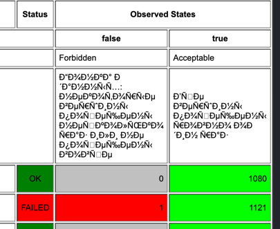
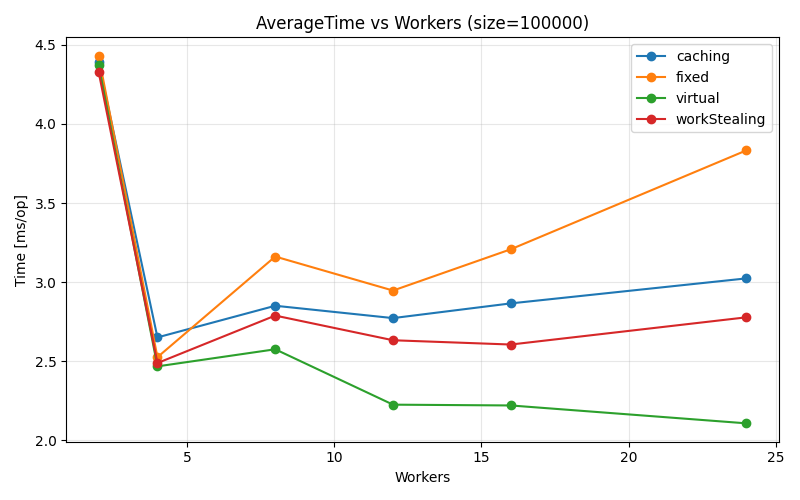
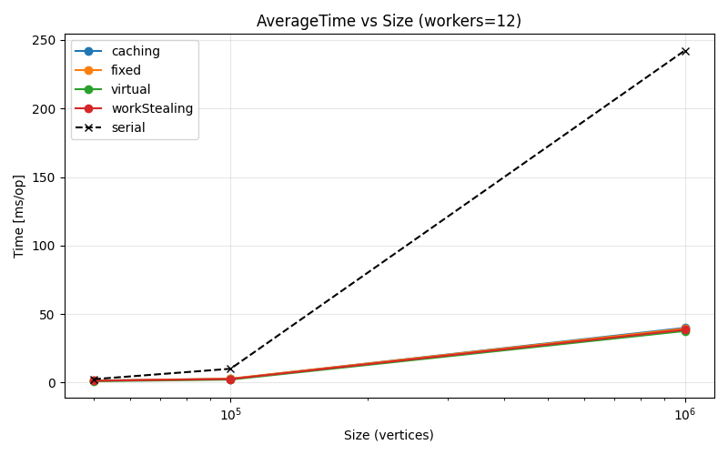

# Результаты экспериментов

Было проведено несколько экспериментов с полученным параллельным алгоритмом обхода в ширину.

Самый базовый - прохождение изначально данного [BFSTest](../src/test/java/org/itmo/BFSTest.java), позволяющего увидеть преимущество над последовательным алгоритмом.
Результаты доступны в [tmp/results.txt](../tmp/results.txt).
Из них можно увидеть, что для небольших графов размером до 10_000 вершин последовательная реализация работает лучше.
Реальный прирост скорости выполнения начинается с 50_000 вершин.

Помимо базового замера производительности алгоритма, так же исследовали наличие гонок и корректность исполнения.
Для этого был написан [BFSCorrectnessTest](../src/test/java/org/itmo/BFSCorrectnessTest.java) с помощью jcstress.
На большом количестве исполнений было проверено, что:
- алгоритм обходит все вершины графа
- алгоритм обходит каждую вершину только один раз

Отчёты в формате html доступны в папке [jcstress](jcstress).

А вот при вызове специально написанной реализации с багом получаем ошибки:

Далее было проведено более подробное исследование возможностей параллельного алгоритма. Были написаны бенчмарки [BFSBenchmark](../src/jmh/java/org/itmo/BFSBenchmark.java) и [BFSSerialBenchmark](../src/jmh/java/org/itmo/BFSSerialBenchmark.java) с помощью jmh.
Здесь мы измеряли зависимости среднего времени исполнения алгоритма от используемого пула и количества воркеров (2, 4, 8, 12, 16, 24}), а также сравнили с временем исполнения последовательного алгоритма на различных размерах графов.
Результаты доступны в папке [benchmark](benchmark), графики - в поддиректории [plots](benchmark/plots).

Например, рассмотрим график зависимости времени исполнения от используемого пула и количества воркеров при 100_000 вершин.

Самым стабильным и готовым к масштабированию показал себя пул на основе виртуальных потоков, в то время как фиксированный пул быстро деградировал при числе потоков, превышающем число ядер на ноутбуке (12) - затраты на переключение контекста становятся более ощутимыми.
Остальные пулы чуть менее подвержены такой выраженной деградации, однако и существенного прироста производительности при дальнейшем наращивании числа воркеров не наблюдается.

График зависимости времени выполнения параллельной и последовательной версий алгоритма в зависимости от объема входных данных наглядно отражает возрастающий отрыв по времени исполнения при возрастающем размере графа.
Можем сделать вывод, что для больших графов параллельный алгоритм оптимальнее, чем последовательный, с точки зрения времени исполнения.
